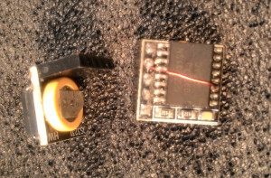
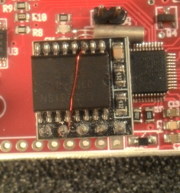

# Schematic and layout
For hysterical reasons, the CAD files were generated using gEDA
`gschem` and `pcb` AKA geda-gaf.  I realise this isn't as popular as
`kicad` and if much further work were to be done on the boards, I
would probably convert them.  But artwork is provided in fab/.

# Components
## RTC
The board and schematic shows an RTC crystal, but the code does
not use this, so it is safe to not install the RTC crystal (and
load capacitors).

The on-board RTC is not used because in order to be useable it
would require a backup battery.  It is much simpler to use an
external off-the-shelf RTC with its own
backup battery.  You can search for "rtc raspberry pi DS3231"
in Aliexpress; these can be had for $1.

This RTC however needs to be modified to be used.  The modification
involves soldering a bodge wire from pin 3 (#INT/SQW)  of the DS3231
to pin 4 of the socket header (which is not used by this
module, so we can use it).  This allows the DS3231 to generate
an alarm interrupt to wake the recorder board from deep sleep.

## I2C sensors
You can attach a BMP280 or BME280 environmental sensor to the
same I2C bus, to record air temperature and barometric pressure
(and relative humidity in the case of BME280).

## Substitutions
Some components may be substituted depending on requirements.

### Crystal oscillator/sample rate
In particular, the oscillator for the ADC is specced as 24.576MHZ,
and this is for sampling at 48 kHz.  The following is taken from
the PCM1808 datasheet:
Sampling Frequency:    Oscillator (clock) frequency:
8 kHz                   4.096 MHz
16 kHz                  8.192 MHz
32 kHz                  16.384 MHz
44.1 kHz                22.5792 MHz
48 kHz                  24.576 MHz
You can choose the proper oscillator frequency for your desired
sampling rate.  (The recorder has not been tested at sampling rates
higher than 48 kHz.)  Then edit src/Makefile to change the line
`DFLAGS+=-DWAV_SPS=44100`
to
`DFLAGS+=-DWAV_SPS=48000`
or whatever in order to match the oscillator actually installed
on your board.
You'll need to rebuild the kinabalu executable:
`$ make clean`
then:
`$ make kinabalu.bin`
from within the src/ directory.

If you reduce the sample rate, you are also limiting
the highest frequency you can make sense of to half that value
(e.g. 8 kHz sample rate means you can record up to 4 kHz sounds at
best) and you should also change the preamp filter to attenuate
anything higher than say 3kHz, certainly 4kHz.

You change the capacitor values to change the filter characteristics.
You could for instance specify a higher passband on one channel
and a lower one on the other.

Don't expect great filter performance, the attenuation of
the rejected frequencies will be noticeable but not stunning.
Also note the component tolerances are poor at perhaps 20%, so the
actual cutoff frequencies will be similarly off.

In many cases the stock filter values will suffice, and you can
digitally filter the files in post processing, which filters are
very much more capable anyway.  The preamp filters are used
mainly to avoid aliasing and to prevent very loud sounds in the
unwanted frequencies from completely swamping the ADC.  Digital
filters cannot help in that case.

The following shows the filter cutoff frequencies and the
corresponding capacitor values.  (Resistor values remain the
same in order to keep the pass band gain unchanged but you can
change these too if you know what you're doing.  But if you know
what you're doing you wouldn't be reading this).

There are 2 high pass filters per channel, and 2 low pass
filters per channel.  Each filter, whether high pass or low
pass, consists of a resistor and a capacitor, which in the table
below is referred to as Rlpf or Rhpf, and Clp or Chpf.  Within
the same channel, you should set both high pass filters to the same
frequency, and both low pass filters to the same frequency.

Keep Hz less than:         C2/C5/C11/C14
16 kHz                     120pF
6 kHz                      330pF
4 kHz                      470pF

And keep Hz greater than:  C4/C6/C13/C15
4 kHz                      4.7nF
2 kHz                      10nF
200 Hz                     100nF
20 Hz                      1uF

