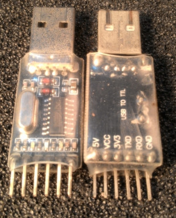

# Build
You don't need to compile in order to programme the board, the
executable image is `src/kinabalu.bin` which you can programme to the
board.  You can skip to the Programming section to do this.

The build environment is plain make, under Ubuntu using
the GNU arm-none-eabi toolchain using the [libopencm3
library](https://github.com/libopencm3/libopencm3).  The Makefile takes
care of programming under stlink and under serial progamming.

The main make target is kinabalu.bin.  The other make targets
(named `test-*`) may be useful for debugging and testing but are not
necessary to build.

# Programming
As with all STM32 microcontrollers, this one can be programmed
using an STLINK-V2 programmer, or it can be programmed using the
builtin bootloader via the serial port.

Given that you will need a serial adapter to view the console
messages anyway, most people will probably opt to use this method.

## Serial programming option
(AKA uploading the programme to the microcontroller, AKA
flashing AKA burning.)
For this you'll need a serial adapter such as CH340, PL2303,
FT232, etc.  Make sure you set the I/O voltage to 3.3V on the
programmer, not 5V.  I use the CH340.

You'll also need a bit of software to programme the kinabalu.bin
image onto the chip.  Under Linux/Ubuntu (and probably Mac, I
can't vouch), I use [stm32flash](https://github.com/stm32duino/stm32flash)
Under Windows, you can [download the programmer software from
ST](https://www.st.com/en/development-tools/stm32cubeprog.html).
(free registration required).

You'll also need to place a jumper across J5, which will cause
the MCU to boot into the correct mode.  Lacking a jumper
you can use a paperclip to short the two pins of J5.

Connect the serial adapter to J1 on the board.  Note the
orientation, it goes ground-tx-rx-nc (the last pin is not
connected).

Connect the 1S battery to J6.  Note very carefully the polarity!
You can use a power supply set to 4V and the current limit
can be 100mA.

Power on the board (S1).

The image to use is `src/kinabalu.bin`.

Under Windows, start the ST-LINK Utility from ST and follow
their instructions.

Under Linux with `stm32flash`
in your path, you can issue the command:

`$ stm32flash -w kinabalu.bin <port>`

where `<port>` is the serial port connected to the serial adapter.

Remove the jumper/paperclip when done.

## STLINK V2 programming option
Most users will prefer to use serial programming (above) rather
than use the STLINK v2, because it
saves having to buy this programmer, which is useful mainly for
developers.

I have used the $2 stlink programmers from Aliexpress.  Search
for "stlink v2".  Be doubly careful with the pinouts when
attaching the connector, and make sure you use the 3.3V (not 5V)
output on the adapter.  The stlink adapter goes on to J2 on
the board.

Unlike programming using the serial adapter, the stlink adapter
power can be used to power the board during programming.
However the power switch (S1) must be turned on even if no external
power is used.  Turning it off shorts the stlink power
to ground (harmlessly).

[Programming software for the stlink v2
adapter](https://github.com/stlink-org/stlink).

With the adapter and board attached,
you can use the Makefile in `src/` to issue the command:

`$ make kinabalu.stflash`

# Testing
You'll need a FAT32 micro SD card.  Copy the sample
configuration file
`src/SITEA-0.LOG`
to it.  If you use a 64GB card, this usually comes formatted
EXFAT, so wll need to be reformatted.  This can be difficult to
do under Windows.

Attach the [modified RTC module](../boards/README.md) onto J4.

You can attach the preamp board with microphones to the audio board,
but this isn't necessary at this stage.

Optionally attach the serial adapter to J1 and set the comms
parameters to 57600 8N1.  This is to ubserve the diagnostics
output.

Turn on the board and observe the LEDs.  If the yellow LED comes
on and remains on, it probably means the RTC hasn't been
synchronised.  Follow the instructions on the console to set the
time, then reboot.

Otherwise the green LED (which indicates SD card activity)
should come on for 20 seconds, during which the board is
recording deployment notes.  You can speak into the microphones,
or if the preamp board is not attached, you can touch your
finger to pins 1 on J7 and J3 (marked L and R) to inject some
noise into the recorder.  After 20 seconds the recorder should
become dormant.

The configuration in `SITEA-0.LOG` tells the recorder to record
for 90 seconds every 2 minutes, so if you wait a few seconds the
recorder will wake up again to record for 90 seconds.  This
behaviour will repeat.

At any point (but preferably when the green LED is off) you can
power off the recorder and check the SD card.

Follow the notes in the `SITEA-0.LOG` file to change the recording
schedule.  There will also be diagnostics appended to that file
to verify correct operation.
